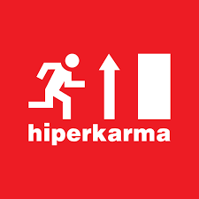

# JAVASCRIPT CSOPORT ZH

## Előkészületek
1. Első lépésként töltsd le github-ról a kiindulófájlokat: 
2. Csomagold ki, majd az alábbi kódrészletet illeszd be a js fájlod elejére. A feladat beküldésével az alább leírtakat megértettnek és elfogadottnak tekintjük annak a nevében, aki a megoldást beküldte.
    ````
    ```
    <Hallgató neve>
    <Neptun kódja>
    Webprogramozás - JavaScript csoport ZH
    Ezt a megoldást a fent írt hallgató küldte be és készítette 
    a Webprogramozás kurzus JavaScript csoport ZH-jához.
    Kijelentem, hogy ez a megoldás a saját munkám. Nem másoltam vagy 
    használtam harmadik féltől származó megoldásokat. Nem továbbítottam 
    megoldást hallgatótársaimnak, és nem is tettem közzé. Az Eötvös Loránd 
    Tudományegyetem Hallgatói Követelményrendszere (ELTE szervezeti és 
    működési szabályzata, II. Kötet, 74/C. §) kimondja, hogy mindaddig, 
    amíg egy hallgató egy másik hallgató munkáját - vagy legalábbis annak 
    jelentős részét - saját munkájaként mutatja be, az fegyelmi vétségnek számít. 
    A fegyelmi vétség legsúlyosabb következménye a hallgató elbocsátása az egyetemről.
    ```
    ````
## Feladat megoldása
A weboldalunk 3 zenekar zeneszámait tartalmazza. Az oldal célja az, hogy a a felhasználó meg tudja adni a nevét, és pontozni tudja egy adott együttes számait.
|A zenekar képe|A zenekar neve|
|---|---|
|| Carson Coma  |
|| Csaknekedkislány |
|| hiperkarma  |


1. Az első feladatot, hogy próbáld meg megoldani, hogy az adott zenekar képére húzva a kurzorunkat, csak az ő táblázatuk látszódjon! A megoldáshoz használd a következő parancsokat:
```js

object.style.display = "none"; // eltünteti az objektumot
object.style.display = "block"; // megjeleníti az objektumot

```
|Feladat|Pont
|---|---|
|Csak egy táblázat látszódik egyszerre a 3-ból|1 pont|
|A képre húzáskor a megfelelő táblázat megjelenik|2 pont|

1. Legalább az egyik táblázatnál csináld meg azt, hogy amelyik sorban van kurzorunk, abban a sorban szöveg betűszíne másmilyen lesz! A megoldáshoz használd Thor delegál függvényét:
```js
function delegal(szulo, gyerek, mikor, mit){
    function esemenyKezelo(esemeny){
        let esemenyCelja    = esemeny.target;
        let esemenyKezeloje = this;
        let legkozelebbiKeresettElem = esemenyCelja.closest(gyerek);

        if(esemenyKezeloje.contains(legkozelebbiKeresettElem)){
            mit(esemeny, legkozelebbiKeresettElem);
        }
    }


    szulo.addEventListener(mikor, esemenyKezelo);
}
```
|Feladat|Pont
|---|---|
|A feladat helyes megoldása|2 pont|
1. Készítsd el, hogy a küldés gombra adja össze az egyes zeneszámok pontszámait, és átlagolja őket. A táblázatot tüntesse el, ismét legyen látható a "calculate" id-val rendelkező div. A div-be jelenjen meg az a szöveg, hogy "Köszönjük a kitöltést, <név>! Az zeneszámokra adott pontszámok átlaga: 9.44". Ennek a feladatnak a megoldásához lehetőség szerint tömbfüggvényt is használj.

|Feladat|Pont
|---|---|
|A feladat helyes megoldása|1 pont|
|A feladat helyes megoldása tömbfüggvénnyel|2 pont|
1. A szöveg alatt jelenjen meg annyi csillag, amennyi az adott pontszámok átlaga volt, egész számra lefelé kerekítve. A csillagok szélességét állítsd át 40px-re.  (A lefelé "kerekítéshez" használj parseInt()-et)

|Feladat|Pont
|---|---|
|A név az átlaggal együtt megjelenítődik|2 pont|
|A csillagok megfelelően megjelennek|1 pont|


Összesen: 10 pont

Egy videó az oldal működéséről: http://nagybrandy.hu/agw/asd.mp4
